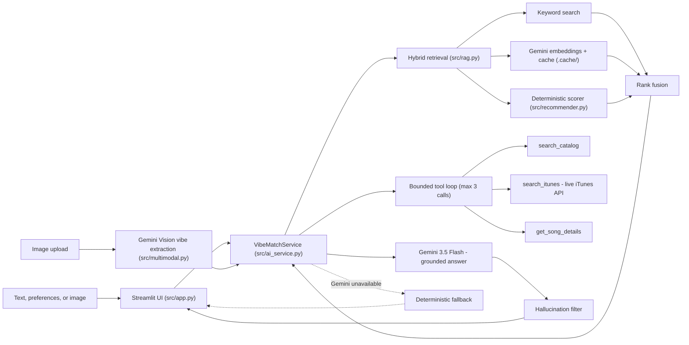

# 🎵 VibeMatch — AI Music Recommender

## Project Summary

VibeMatch is an applied AI music recommendation system built on an 18-song
catalog. A user describes a vibe in plain text (or uploads an image of it),
and VibeMatch retrieves candidate songs with hybrid RAG — keyword search,
Gemini vector embeddings, and the original deterministic scoring recipe
fused together — then has Gemini write grounded recommendations that cite
exactly which catalog records or live iTunes results each pick came from.
Gemini can also call tools mid-conversation (`search_catalog`,
`search_itunes`, `get_song_details`) when the initial evidence is thin.

Underneath the AI layer sits the original transparent scoring system:
genre/mood/energy point weights, four scoring modes, and artist/genre
diversity re-ranking — which doubles as a working fallback when the Gemini
API is unavailable.

---

## How The System Works

Real platforms like Spotify mostly blend two approaches. **Collaborative
filtering** predicts what you'll like from *other users'* behavior: likes,
skips, playlist co-occurrence, listening history, even without knowing
anything about the song itself. **Content-based filtering** predicts from
the *song's own* attributes: genre, mood, tempo, energy, matched against
a profile built from what you've liked before. Collaborative filtering finds
patterns humans wouldn't think to encode by hand, but needs a large user base
and struggles with new/unpopular songs ("cold start"). Content-based works
from day one with no other users, but stays inside your stated taste and
won't surprise you the way "people like you also liked X" can.

This simulation is **content-based only**: no other users, no play history,
just song attributes scored against one stated profile.

- `Song` features: `genre`, `mood`, `energy`, `tempo_bpm`, `valence`,
  `danceability`, `acousticness` (see `data/songs.csv`)
- `UserProfile` stores: `favorite_genre`, `favorite_mood`, `target_energy`,
  `likes_acoustic`
- **Scoring rule** (per song): exact match on `genre` and `mood` each add
  fixed points (genre weighted higher since it's a stronger taste signal
  than mood); `energy` is scored by closeness to `target_energy`
  (`1 - abs(song.energy - target_energy)`) rather than "higher is better",
  since a user wanting calm music shouldn't get the most intense song in the
  catalog; `acousticness` adds a small bonus only when `likes_acoustic` is
  true.
- **Ranking rule**: score every song, sort descending, return the top `k`.
  The scoring rule handles *one* song in isolation; the ranking rule turns
  many individual scores into an ordered list. You need both because a
  score alone doesn't tell you how a song compares to the rest of the
  catalog.

### Algorithm Recipe (finalized)

`user_prefs = {"genre": "lofi", "mood": "chill", "energy": 0.4}` is the
example profile used for planning and manual testing.

Per song, starting from 0 points:

- `+2.0` if `song.genre == user_prefs["genre"]`
- `+1.0` if `song.mood == user_prefs["mood"]`
- `+ (1 - abs(song.energy - user_prefs["energy"]))` similarity points for
  energy, so a near-exact energy match is worth close to `+1.0` and a
  wildly mismatched one is worth close to `0`

Genre outweighs mood 2:1 because in this catalog genre is the stronger,
more stable taste signal; mood shifts more from song to song within the
same artist.

**Data flow:** `Input (user_prefs dict)` &rarr; `Process (loop: score_song()
over every row in songs.csv)` &rarr; `Output (sort by score, return top k)`.

---

## Features

**AI system**

- Hybrid RAG: keyword search + Gemini vector embeddings + deterministic scoring, fused with reciprocal-rank and weighted rank fusion
- Grounded Gemini answers that cite only catalog records or live iTunes results; a hallucination filter drops any title outside both sets
- Bounded tool calling: Gemini can invoke `search_catalog`, `search_itunes`, and `get_song_details` (max 3 calls per request, with graceful exhaustion fallback)
- Multimodal input: upload an image and Gemini Vision extracts mood/energy/aesthetic/activity tags that become the retrieval query
- Live discovery via the iTunes Search API, with album artwork, 30-second previews, and Apple Music links
- Deterministic fallback: if Gemini fails, is rate-limited, or no key is configured, the original scoring engine still serves recommendations
- Streamlit web interface with structured preference controls, chat history, source labels, and system-health indicators

**Original recommender (preserved)**

- Content-based scoring over genre, mood, energy, and 5 optional advanced attributes
- 4 scoring modes (Strategy pattern): `balanced`, `genre-first`, `mood-first`, `energy-focused`
- Artist/genre diversity re-ranking with visible penalties (shared by both API paths)
- Explainable recommendations (every point contribution listed)
- CLI interface with aligned summary table

---

## Architecture



**Component responsibilities**

- `src/app.py` — Streamlit interface; builds `user_prefs`, handles text/image input, renders source-separated results
- `src/ai_service.py` — orchestration: retrieval → tool loop → grounded generation → hallucination filter → fallback
- `src/rag.py` — documents, keyword/vector retrieval, query expansion, rank fusion, embedding cache
- `src/recommender.py` — the original transparent scoring recipe, scoring modes, diversity (used as a ranking signal AND as the fallback)
- `src/multimodal.py` — image validation + Gemini Vision → structured `VibeProfile`
- `src/tools.py` — iTunes Search API client with 5s timeout, plus catalog tool helpers

---

## AI Model Details

| Piece | Choice |
|---|---|
| Generation (chat, tools, vision) | `gemini-3.5-flash` (GA) |
| Embeddings | `gemini-embedding-001` (text), cached in `.cache/song_embeddings.json` |
| Temperature | 0.2 (low, for grounded factual answers) |
| Tool loop budget | Max 3 tool calls per request |
| iTunes timeout | 5 seconds |
| Config | `GEMINI_API_KEY`, `GEMINI_MODEL`, `GEMINI_EMBEDDING_MODEL` in `.env` (see `.env.example`) |

**Grounding strategy.** The system prompt restricts Gemini to the evidence in
the prompt (retrieved catalog documents + iTunes results) and requires a
source + evidence citation per recommendation. A post-processing
hallucination filter then drops any recommended title not present in the
full catalog or the live result set — so even a model that complies with a
prompt injection cannot surface an invented song (verified by evaluation
case-6).

**Free-tier note.** `gemini-3.5-flash` free tier allows ~20 generation
requests/day. When exhausted, the app automatically serves deterministic
recommendations and says so. `GEMINI_MODEL` can be switched to
`gemini-3.1-flash-lite` (separate quota) without code changes.

**Known bias:** this recipe over-prioritizes genre. A right-genre song that
matches nothing else scores 2.0. A wrong-genre song with a perfect mood
match and a near-perfect energy match tops out just under 2.0 (1.0 mood
plus almost 1.0 energy). So the wrong-genre song usually loses even when
it fits the user's mood and energy far better, unless its energy match is
close to exact.

---

## Getting Started

### Setup

1. Create a virtual environment (optional but recommended):

   ```bash
   python -m venv .venv
   source .venv/bin/activate      # Mac or Linux
   .venv\Scripts\activate         # Windows

2. Install dependencies

```bash
pip install -r requirements.txt
```

3. (Optional, needed for the AI features) configure your Gemini API key:

```bash
cp .env.example .env   # then paste your key from https://aistudio.google.com/apikey
```

The CLI recommender works without a key; RAG/chat/image features require one.

4. (Optional, speeds up first AI request) build the embedding cache:

```bash
python -m src.build_embeddings
```

5. Run the app — web interface:

```bash
streamlit run src/app.py
```

or the original CLI (no API key needed):

```bash
python -m src.main            # add a mode: balanced | genre-first | mood-first | energy-focused
```

### Running Tests

```bash
pytest -v
```

### Running the Evaluation Harness

```bash
python evaluation/run_evaluation.py          # mocked Gemini, CI-safe
python evaluation/run_evaluation.py --live   # real API (uses free-tier quota)
```

Results are written to `evaluation/results.md` (mocked) and
`evaluation/results-live.md` (live).

---

## Sample Recommendation Output

Output of `python -m src.main` with the default profile
`{"genre": "pop", "mood": "happy", "energy": 0.8}` (`balanced` mode):

```
Loaded songs: 18

Mode: balanced

Title          | Score | Reasons
---------------+-------+-------------------------------------------------------------------
Sunrise City   | 3.98  | genre match (+2.0), mood match (+1.0), energy similarity (+0.98)
Gym Hero       | 2.87  | genre match (+2.0), energy similarity (+0.87)
Rooftop Lights | 1.96  | mood match (+1.0), energy similarity (+0.96)
Concrete Bloom | 1.00  | energy similarity (+1.00)
Riot Fuel      | 0.90  | energy similarity (+0.90)
```

Note this replaces `Night Drive Loop` (the un-penalized #5 result) with `Riot
Fuel`, see **Bonus Challenges** below for why.

**Screenshot or video**: <!-- Insert app screenshot or demo video link here -->

**Demo checklist** (record after docs are in):

1. `streamlit run src/app.py` → text query "chill lo-fi for late night studying" → grounded picks with evidence
2. Toggle *Include live iTunes discoveries* → query a genre the catalog lacks (e.g. reggae) → artwork + preview link
3. Upload an image in the *Match this vibe* tab → extracted mood/energy → recommendations
4. Show fallback: temporarily set `GEMINI_MODEL=invalid` → warning banner + deterministic list (restore after)
5. Terminal: `pytest -q` (48 passed) and `python evaluation/run_evaluation.py` (6/6)

---

## Evaluation

The automated harness in `evaluation/` runs six cases — clear preference
match, natural-language mood request, contradictory preferences, unsupported
genre, Gemini API failure, and a prompt-injection attempt — checking
groundedness (no invented songs), citation completeness, fallback behavior,
forbidden-title absence, and latency.

Latest results: **6/6 pass** in both modes.

- Mocked (CI-safe): [evaluation/results.md](evaluation/results.md)
- Live Gemini API: [evaluation/results-live.md](evaluation/results-live.md)

Unit/integration coverage: 48 tests across recommender scoring, diversity,
retrieval, tools, multimodal validation, orchestration, fallback, and the
UI preference builder. CI runs the full suite on every push (GitHub Actions,
`.github/workflows/ci.yml`).

## Manual Experiments (original deterministic engine)

### Stress test: four profiles

```
=== High-Energy Pop -> {'genre': 'pop', 'mood': 'happy', 'energy': 0.9} ===
Sunrise City - Score: 3.92
Because: genre match (+2.0), mood match (+1.0), energy similarity (+0.92)
Gym Hero - Score: 2.97
Because: genre match (+2.0), energy similarity (+0.97)
Rooftop Lights - Score: 1.86
Because: mood match (+1.0), energy similarity (+0.86)
Riot Fuel - Score: 1.00
Because: energy similarity (+1.00)
Storm Runner - Score: 0.99
Because: energy similarity (+0.99)

=== Chill Lofi -> {'genre': 'lofi', 'mood': 'chill', 'energy': 0.3} ===
Library Rain - Score: 3.95
Because: genre match (+2.0), mood match (+1.0), energy similarity (+0.95)
Midnight Coding - Score: 3.88
Because: genre match (+2.0), mood match (+1.0), energy similarity (+0.88)
Spacewalk Thoughts - Score: 1.98
Because: mood match (+1.0), energy similarity (+0.98)
Tears in Neon - Score: 1.00
Because: energy similarity (+1.00)
Dust Road Home - Score: 0.97
Because: energy similarity (+0.97)

=== Deep Intense Rock -> {'genre': 'rock', 'mood': 'intense', 'energy': 0.9} ===
Storm Runner - Score: 3.99
Because: genre match (+2.0), mood match (+1.0), energy similarity (+0.99)
Gym Hero - Score: 1.97
Because: mood match (+1.0), energy similarity (+0.97)
Riot Fuel - Score: 1.00
Because: energy similarity (+1.00)
Iron Collapse - Score: 0.93
Because: energy similarity (+0.93)
Sunrise City - Score: 0.92
Because: energy similarity (+0.92)

=== Adversarial (genre metal, mood sad, energy 0.9) -> {'genre': 'metal', 'mood': 'sad', 'energy': 0.9} ===
Iron Collapse - Score: 2.93
Because: genre match (+2.0), energy similarity (+0.93)
Tears in Neon - Score: 1.40
Because: mood match (+1.0), energy similarity (+0.40)
Riot Fuel - Score: 1.00
Because: energy similarity (+1.00)
Storm Runner - Score: 0.99
Because: energy similarity (+0.99)
Gym Hero - Score: 0.97
Because: energy similarity (+0.97)
```

The first three profiles "feel" right: each top result is exactly the genre/mood/energy combo it asked for (Sunrise City for happy pop, Library Rain for chill lofi, Storm Runner for intense rock). `Sunrise City` beats `Gym Hero` for the pop profile because genre+mood both match (+3.0) even though `Gym Hero` is closer on raw energy, matching genre and mood is worth more than a slightly tighter energy number.

The fourth profile is a contradiction on purpose: "metal" (usually high energy) paired with mood "sad" (usually low energy) and a high target energy. The system doesn't notice the contradiction, it just adds up points. `Iron Collapse` wins on genre plus energy while completely ignoring mood. `Tears in Neon`, the one song that actually matches the stated mood, drops to second because its energy (0.30) is far from the requested 0.9. A user who typed "sad" probably wanted `Tears in Neon`, not an aggressive metal track.

(Note: this block was regenerated after the Bonus Challenges below added a diversity penalty. Chill Lofi previously included `Focus Flow`, LoRoom's second lofi/chill-adjacent song, at #3; it now drops out in favor of `Dust Road Home` because `Focus Flow` shares an artist with the already-picked `Midnight Coding` and would be the catalog's third lofi pick in a row. The other three profiles were unaffected since none of their top 5 shared an artist or tripled up on genre.)

### Weight-shift experiment: genre 2.0 → 1.0, energy ×2

Same High-Energy Pop profile, ranking barely moved (still Sunrise City, Gym Hero, Rooftop Lights, Riot Fuel, Storm Runner in that order) with the top-3 gap much tighter, from 2.06 points down to 1.12.

The bigger effect showed up on the adversarial profile:

```
=== Adversarial (genre halved, energy doubled) ===
Iron Collapse - Score: 2.86
Because: genre match (+1.0), energy similarity (+1.86)
Riot Fuel - Score: 2.00
Because: energy similarity (+2.00)
Storm Runner - Score: 1.98
Because: energy similarity (+1.98)
Gym Hero - Score: 1.94
Because: energy similarity (+1.94)
Sunrise City - Score: 1.84
Because: energy similarity (+1.84)
```

`Tears in Neon`, the only song matching the requested mood, fell out of the top 5 entirely, replaced by four songs that match nothing but raw energy (not even genre). Doubling the energy weight didn't make this profile's results more accurate, it made them worse: the list is now just "loudest songs available" with taste signals drowned out. This change was reverted; the shipped system still uses genre 2.0 / mood 1.0 / energy ×1.

---

## Bonus Challenges

Four stretch features on top of the core system, all in `src/recommender.py` /
`src/main.py`, all backward compatible (existing tests and the default
`balanced`-mode profile still behave the same on the shared genre/mood/energy
axes):

1. **Advanced song features.** Added 5 new columns to `data/songs.csv`:
   `popularity` (0-100), `release_decade`, `detailed_mood_tags`
   (semicolon-separated), `instrumentalness`, `language`. `Song` and
   `UserProfile` grew matching fields (all optional, default `None`/neutral,
   so old code paths that don't set them are untouched). `score_song()` /
   `Recommender._score()` add bonus points for each one the user actually
   specifies: popularity/instrumentalness by closeness (up to +0.5 each),
   decade and language by exact match (+0.5 each), mood tags by overlap
   count (+0.5 per shared tag). See the advanced-profile example run in
   `ai_interactions.md`.

2. **Multiple scoring modes (Strategy pattern).** `SCORING_MODES` is a dict
   of named genre/mood/energy weight presets (`balanced`, `genre-first`,
   `mood-first`, `energy-focused`); `score_song()`, `recommend_songs()`, and
   `Recommender.recommend()` all take a `mode` argument that looks up a
   preset instead of branching on if/elif. Switch modes from the CLI:
   `python -m src.main mood-first`. See `ai_interactions.md` for why a
   dict-of-presets was chosen over a full class-per-strategy hierarchy.

3. **Diversity penalty.** `recommend_songs()` (the functional path used by
   the CLI) now builds its top-`k` list greedily: after each pick, any
   remaining song by the same artist takes a `-1.5` penalty, and any song
   from a genre already picked twice takes a `-0.75` penalty, before the
   next pick is chosen. This only touches `recommend_songs()`, not the OOP
   `Recommender.recommend()` that `tests/test_recommender.py` exercises,
   since that test's fixture deliberately reuses one artist across both
   songs and asserts `k=2` results back.

4. **Visual summary table.** `main.py` has a small stdlib-only
   `_format_table()` helper (no new dependency) that renders the CLI output
   as an aligned ASCII table with Title / Score / Reasons columns instead of
   one print per line.

---

## Stretch Goals and Bonus Features

**Final-assignment stretches** (what, why, and the extra effort):

1. **Advanced RAG** — hybrid keyword + Gemini vector + deterministic retrieval with query expansion and rank fusion. *Why:* a pure embedding search misses exact genre/energy intent on an 18-song catalog; fusing three signals covers both semantic vibe and hard constraints. *Effort:* custom fusion logic, embedding cache, offline mode, 12 retrieval tests.
2. **Multimodal AI** — image upload → Gemini Vision → structured vibe profile (mood/energy/aesthetic/activity) → retrieval query. *Why:* "match this vibe" is the most natural way to ask for music. *Effort:* image validation (type/size/signature), strict JSON extraction, failure handling, 9 tests.
3. **Complex tool use** — Gemini function-calling loop with `search_catalog`, `search_itunes`, `get_song_details`; bounded at 3 calls with exhaustion fallback. *Why:* lets the model seek more evidence instead of guessing, and the live iTunes tool extends a tiny catalog to the real world. *Effort:* manual multi-turn loop (not SDK auto-calling) for explicit budget control, tool-evidence merging with the hallucination filter, 3 dedicated tests.
4. **Evaluation framework** — custom automated harness (`evaluation/`) with groundedness, citation, fallback, forbidden-title, and latency checks, runnable mocked (CI) or live. *Why:* "it worked when I tried it" is not evidence; the injection and outage cases only exist because a harness makes them repeatable. *Effort:* 6 cases × 2 modes, results committed to the repo.
5. **User interface** — Streamlit app with structured controls, chat history, image input, source-labeled results, artwork/previews, health indicators. *Why:* a recommender you can't click through isn't demoable. *Effort:* tabbed layout, error/empty states, session management.

Also met from the rubric's stretch column: multiple AI features, multi-source + real-time data (CSV + live iTunes), advanced error recovery + proactive health indicators, comprehensive edge-case test suite (48 tests), and CI via GitHub Actions.

**Original starter-repo bonuses** (completed earlier, all preserved and tested):

1. **Advanced song features** — 5 extra CSV attributes with optional scoring bonuses.
2. **Multiple scoring modes** — Strategy-pattern weight presets, CLI-switchable.
3. **Diversity penalty** — shared by both API paths after Part 1 consolidation.
4. **Visual summary table** — stdlib ASCII table in the CLI.

---

## Limitations and Risks

- 18-song local catalog. There's no guarantee a good match for any given profile exists at all; the iTunes tool mitigates discovery but its results are not scored against the taste profile.
- Genre outweighs mood 2:1, so a wrong-genre song can lose to a right-genre song even when it fits the user's mood and energy far better (see the adversarial profile above).
- No contradiction detection. A profile like `genre=metal, mood=sad, energy=0.9` is internally inconsistent; the deterministic scorer just adds points, though the Gemini layer usually names the trade-off in its summary.
- Content-based only, no other users, no play history, no lyrics or audio analysis, no way to learn from skips or replays over time.
- LLM risks: hallucinated songs (mitigated by the catalog-wide filter), prompt injection (same filter + restricted system prompt; see evaluation case-6), and nondeterminism (temperature 0.2 reduces but doesn't eliminate it).
- Privacy: queries, preferences, and uploaded images are sent to the Gemini API; iTunes queries go to Apple. Nothing is stored server-side by this app, but the data does leave your machine.
- Free-tier quota (~20 Gemini requests/day) means the AI layer can cut out mid-demo; the deterministic fallback exists for exactly this reason.

---

## Reflection

Read and complete `model_card.md`:

[**Model Card**](model_card.md)

Recommenders turn data into predictions by picking a few features
(here: genre, mood, energy), assigning them point values, and adding
up whichever ones match. There's no magic in it, the "prediction" is
just arithmetic over whatever the designer decided to weight. That also
means the designer's weight choices are the product: giving genre twice
the points of mood wasn't a neutral technical decision, it's a bet about
what matters most, and that bet shapes every recommendation the system
makes.

Bias showed up fastest at the seams: a profile that mixed a genre
associated with high energy and a mood associated with low energy
exposed that the system trusts genre over mood without ever saying so.
Real recommenders have the same shape of problem at a much bigger
scale: whatever the system is built to weight most heavily is what it
will keep pointing users back toward, whether or not that's actually
what they meant. See [model_card.md](model_card.md) for the full
evaluation and bias write-up.


